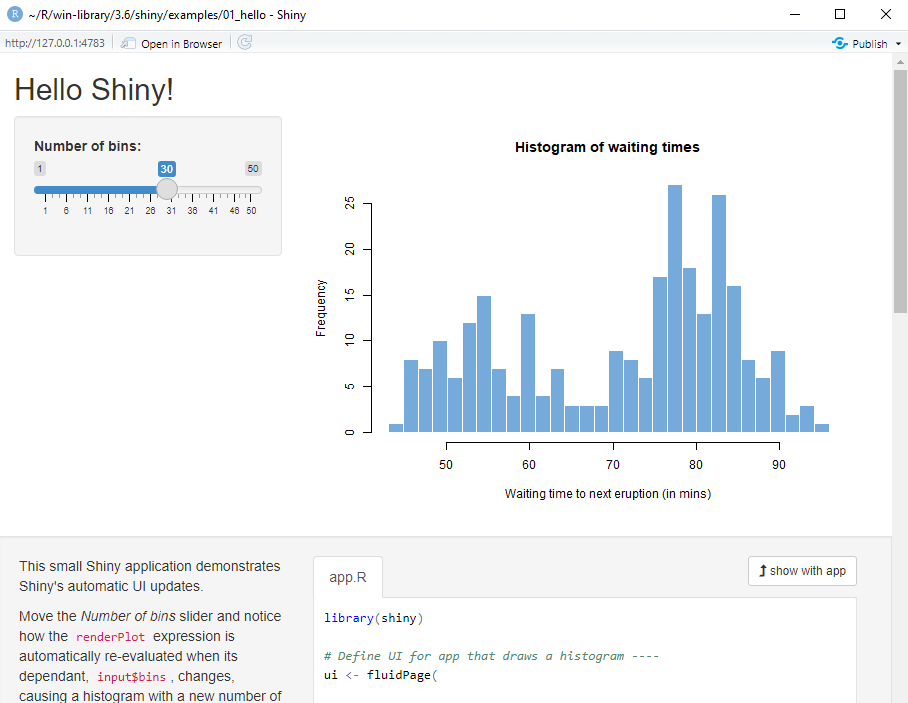
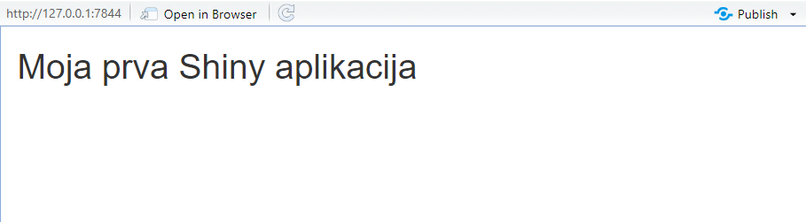
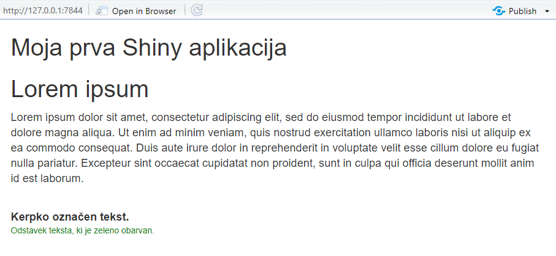
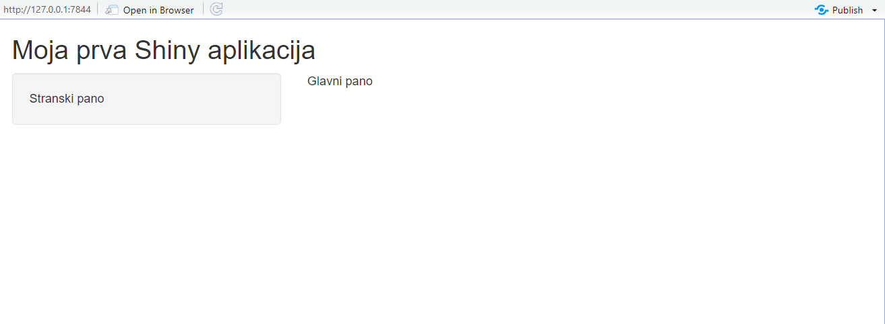
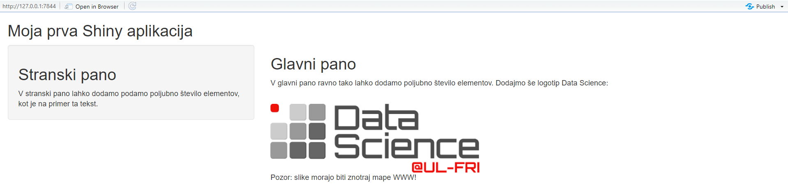
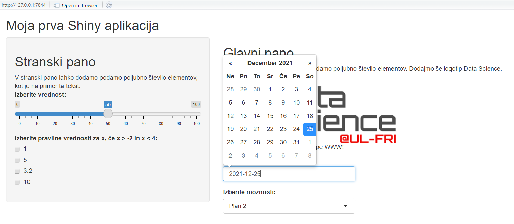
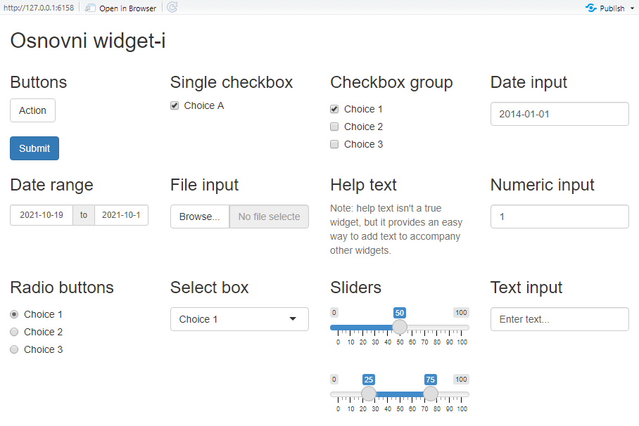
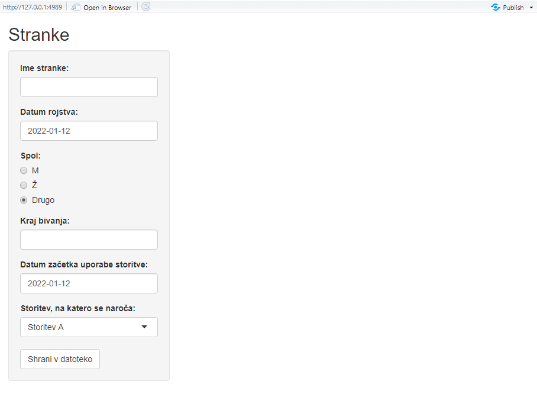

# Statični dashboard

## Priprava

Cilj današnjega predavanja je, da spoznamo knjižnico Shiny in strukturo njenih aplikacij. Spoznali bomo osnovne gradnike uporabniškega vmesnika, zaradi česar se bomo zaenkrat omejili le na statične aplikacije. Interaktivne aplikacije bomo spoznali v naslednjem poglavju.

Najprej je seveda pomembno, da si namestimo potreben paket **Shiny**  z ukazom *install.packages*.

Odpremo RStudio in v konzolo vpišemo ukaz:

```{r eval=F}
install.packages(shiny)
```

Ko je namestitev končana, naložimo paket in z ukazom *runExample* preverimo, če deluje:

```{r eval=F}
library(shiny)

runExample("01_hello")
```

Če vse deluje pravilno, bi se moralo odpreti okno, kot je prikazano na tej sliki:

<div style= "border : 2px solid gray" style = "padding: 3px">



</div>

Postavitev elementov je odvisna od velikosti odprtega okna in se lahko nekoliko razlikuje od primera na zgornji sliki. V vsakem primeru lahko z drsnikom spreminjamo število košev, ki v grafu predstavljajo število stolpcev histograma. Na ta način lahko avtomatsko spreminjamo prikaz histograma. Ko zaključimo z uporabo aplikacije, s klikom na gumb X v zgornjem desnem kotu aplikacijo zapremo. Na ta način ustavimo proces v ozadju. Ko se vrnemo v Rstudio, lahko preberemo sporočilo: `Listening on http://127.0.0.1:7844`. Rstudio je pripravljen na izvedbo novega ukaza. To pomeni, da je aplikacija uspešno zaprta. Če Rstudio ni pripravljen na nov ukaz, je aplikacija še vedno odprta nekje v ozadju.

Poleg prvega primera "01_hello" lahko poženemo tudi druge že pripravljene primere. Tako dobimo občutek, kaj vse nam nudi paket Shiny.

```{r eval = F}
runExample("01_hello") # histogram
runExample("02_text") # tabele in data frame-i
runExample("03_reactivity") # reaktivni izrazi
runExample("04_mpg") # globalne spremenljivke
runExample("05_sliders") # drsniki
runExample("06_tabsets") # zavihki
runExample("07_widgets") # tekst za pomoč in akcijski gumbi
runExample("08_html") # aplikacija Shiny sestavljena iz HTML
runExample("09_upload") # primer prenašanja datotek
runExample("10_download") # primer nalaganja datotek
runExample("11_timer") # samodejni timer
```

## Moja prva Shiny aplikacija

Novo aplikacijo Shiny lahko ustvarimo s čarovnikom. V meniju izberemo *File -> New File -> Shiny Web App*. Ta proces privzeto ustvari mapo z izbranim imenom in pripravljeno skripto *app.R*, ki predstavlja začetni primer.

Prvo aplikacijo bomo ustvarili kar sami. Odprimo novo skripto R in vpišimo te ukaze:

```{r eval = F}
library(shiny)

ui <- fluidPage(
  titlePanel("Moja prva Shiny aplikacija")
)

server <- function(input, output){}


shinyApp(ui = ui, server = server)
```

Dokler skripte R ne shranimo, bo orodna vrstica na vrhu izgledala takole:

<div style= "border : 2px solid gray" style = "padding: 3px">


</div>


Ko pa skripto shranimo, se orodna vrstica spremeni v:

<div style= "border : 2px solid gray" style = "padding: 3px">


</div>


Kadar Rstudio v zadnji vrstici skripte zazna ukaz `shinyApp`, samodejno prilagodi orodno vrstico za delo s Shiny R-jem. Še opozorilo: če vas R vpraša, v katerem kodiranju želite shraniti skripto, izberite UTF8. Paket Shiny za pravilno delovanje uporablja to kodiranje.

Sedaj s klikom na gumb *Run App* poženimo našo prvo aplikacijo. Prikaže se nam okno:

<div style= "border : 2px solid gray" style = "padding: 3px">



<br> </br>

</div>

Čeprav ukazov iz zgornje skripte še nismo razložili, smo ustvarili našo prvo in najbolj osnovno aplikacijo Shiny. Aplikacija nam izpiše le naslov. V nadaljevanju si bomo podrobneje ogledali, katere gradnike nudi knjižnica Shiny.

## Osnovni sestavni deli

Naša skripta vsebuje vse potrebne sestavne dele za delovanje aplikacije. Kodo znotraj vsake skripte delimo na 3 glavne sestavne dele:

- objekt za izdelavo uporabniškega vmesnika imenovan `ui`,
- strežniško funkcijo `server` in
- klic funkcije `shinyApp`.

V uporabniškem vmesniku določimo razporeditev uporabljenih komponent in obliko naše aplikacije. Znotraj njega definiramo vse komponente spletne strani, kot so besedilo, polja za vnos besedila, polja za izris grafa, itd. Uporabniški vmesnik definiramo s klicem funkcije Shiny, ki sestavi spletno stran v jeziku HTML (v prejšnjem primeru je to `fluidPage()`, ki lahko avtomatsko razporeja elemente dashboard-a). 

V strežniški funkciji pripada vsakemu izhodu (izpis teksta, izris grafa…) del kode, ki se izvede ob uporabnikovem dejanju oz. ko pride do spremembe. Strežniško funkcijo definiramo tako, da sprejme dva parametra: vhod in izhod. Ko sta ti dve komponenti pripravljeni, lahko kličemo ukaz `shinyApp(ui = < moj_vmesnik >, server = < moj_strežnik >)`, ki aplikacijo sestavi in požene.

Če si predstavljamo uporabniški vmesnik kot komponento, ki naši aplikaciji daje obliko, si lahko strežniško funkcijo predstavimo kot komponento, ki naši aplikaciji daje odzivnost. Znotraj nje definiramo vsa pravila in ukaze, ki so potrebni za interaktivno delovanje aplikacije. Delovanje strežniške funkcije bomo spoznali v naslednjem predavanju, danes pa se posvetimo uporabniškem vmesniku.

## Formatiranje teksta

Preden se naučimo uporabljati bolj zapletene objekte, si oglejmo, kako v aplikacijah Shiny oblikujemo besedilo. Ko poženemo aplikacije, se te prepišejo v jezik HTML. Če želimo besedilo naših aplikacij preoblikovati, moramo navodila za preoblikovanje spremeniti v jezik HTML. Shiny R ponuja vrsto funkcij za oblikovanje besedila, ki se ujemajo z oznakami programskega jezika HTML. Nekaj primerov:

Funkcija v R | oznaka HTML | Pomen
:----| :---- | :----
`p()`|`<p>` | Odstavek teksta.
`h1()`|`<h1>` | Naslov prvega nivoja.
`h2()`|`<h2>` | Naslov drugega nivoja.
... | ... | ...
`h6()`|`<h6>` | Naslov šestega nivoja.
`strong()`|`<strong>` | Krepko označeno besedilo.
`em()`|`<em>` | Ležeče označeno besedilo.
`a()`|`<a>` | Povezava.
`br()`|`<br>` | Prekinitev vrstice (prazna vrstica).
`code()`|`<code>` | Tekst v obliki kode.

R funkcije poleg besedila, ki ga želimo izpisati, sprejmejo tudi parametre, ki definirajo slog, bravo... Te definiramo v slogu programskega jezika CSS (Cascading Style Sheet), oziroma tako, da jih podamo v obliki" `"<argument1> : <vrednost1>; <argument2> : <vrednost2>; ".."`. 

Poglejmo si preprost primer:

```{r eval = F}
ui <- fluidPage(
  titlePan"l("Moja prva Shiny aplikac"ja"),
  h2("Lorem ipsum"), #podnaslov
  
  #odsek teksta

  p("Lorem ipsum dolor sit amet, consectetur adipiscing elit, sed do eiusmod tempor incididunt ut labore et dolore magna aliqua. Ut enim ad minim veniam, quis nostrud exercitation ullamco laboris nisi ut aliquip ex ea commodo consequat. Duis aute irure dolor in reprehenderit in voluptate velit esse cillum dolore eu fugiat nulla pariatur. Excepteur sint occaecat cupidatat non proident, sunt in culpa qui officia deserunt mollit anim id est laborem."),
    
  br(), # prekinitev

  strong("Kerpko označen tekst."),

  br(), # prekinitev

  p("Odstavek teksta, ki je zeleno obarvan.", 
    style = "color:green; font-size:8pt") #CSS stil
)

```

<div style = "border : 2px solid gray" style= "padding: 3px">



</div>

V prvem primeru smo že spoznali funkcijo `titlePanel`, ki izpiše naslov aplikacije. Enak napis bi dobili, če bi funkcijo `titlePanel` zamenjali s funkcijo `h2`. Vse elemente, ki jih želimo prikazati na strani (*fluidPage*), podamo kot parametre tej funkciji. V našem primeru smo najprej dodali dva naslova, nato odstavek s tekstom, ki se avtomatsko prilagaja velikosti strani. Temu sledi še odebeljen tekst in na koncu poljubno formatiran tekst z uporabo CSS.

## Stranski pano in vnos slik

Če aplikaciji dodamo različne elemente, se bodo ti prikazali vsak v svoji vrstici. Zato paket Shiny vsebuje funkcije, s katerimi lahko razporejamo objekte. V sklopu tega predavanja bomo spoznali le eno razporeditev, na tretjem predavanju pa bomo spoznali še druge razporeditve.

Funkcija `sidebarLayout` razdeli stran na stranski in glavni pano. Funkcija prejme dva vhodna parametra, `sidebarPanel` in `mainPanel`, kjer vsak vsebuje svoje komponente (tekst, polja, drsnike, grafe, itd.). 

Poglejmo si najbolj preprosto uporabo tega gradnika:

```{r eval = F}
ui <- fluidPage(
  titlePanel("Moja prva Shiny aplikacja"),

  # Razporediev sidebarLayout
  sidebarLayout(

  # Stranski pano
  sidebarPanel("Stranski pano"),

  # Glavni pano
  mainPanel("Glavni pano")
  )

)

```

<div style= "border : 2px solid gray" style = "padding: 3px">



</div>

Prikaže se nam okno z dvema gradnikoma, ki vsebujeta le tekst. Leva tretjina zaslona je privzeto namenjena stranskemu panoju, desni dve tretjini pa glavnemu panoju. V primeru, da je celotno okno preozko, pa se lahko stranski pano premakne tudi na vrh zaslona. Več o ročni nastavitvi postavitve panojev bomo povedali na tretjem predavanju.

V spodnjem primeru nadgradimo zgornji primer tako, da vsak pano vsebuje več gradnikov in dodamo logotip Data Science:


```{r eval = F}
ui <- fluidPage(
  titlePan"l("Moja prva Shiny aplikac"ja"),

  # Razporediev sidebarLayout
  sidebarLayout(
    
    # Stranski pano
    sidebarPanel(
  
    h2("Stranski pano"), # Naslov
  
    "V stranski pano lahko dodamo podamo poljubno število elementov, \
kot je na primer ta tekst.", # Tekst

  ), 

  # Glavni pano

  mainPanel(
    h2("Glavni pano"), # Naslov
  
    p("V glavni pano ravno tako lahko dodamo poljubno število elementov. \
    Dodajmo še logotip Data Science:"), # Tekst
  
    br(), # Dodamo malo prostora 
  
    img(src = "images\\DS_FRI_logo.png", 
        align = "center"), # Slika
  
    p("Pozor: slike morajo biti znotraj mape www!")
    )
  )
)

```

<div style= "border : 2px solid gray" style = "padding: 3px">



</div>

Aplikacija ima na levi strani stranski pano, na desni pa glavnega. Za vsako komponento v panojih smo klicali funkcijo, ki izpiše panoju kodo HTML za dani objekt.

V tem primeru smo aplikaciji dodali tudi sliko. V aplikacijo Shiny lahko vnesemo sliko s funkcijo `img()`, vendar se mora v mapi z izvorno skripto nahajati mapa _www_, v kateri je shranjena slika. Vse poti, ki jih podamo funkciji, so relativne glede na to mapo, zato je v prejšnjem primeru naša slika v mapi *www/images*. V mapi www poleg slik lahko hranimo tudi datoteke s pravili za oblikovanje, tekste in druge zunanje elemente, ki jih vnašamo v našo spletno aplikacijo.

## Kontrolni Widgeti

**Widget-i** so pomembni elementi uporabniškega vmesnika, ker nam omogočajo interakcijo z aplikacijo. V tem poglavju na kratko pogledamo kateri so osnovni **widget-i** paketa Shiny, kako delujejo, pa bomo pokazali na naslednjem predavanju, saj moramo za to prej predstaviti strežniško funkcijo. Omenimo le, da jim kot prvi argument podamo **identifikacijsko ime** (*lahko vsebuje le črke, številke ali podčrtaj*), s katerim lahko dostopamo do posameznih vrednosti widget-a.

V spodnji tabeli so prikazani widgeti paketa Shiny:

| funcija | opis |
| :---- | :----- |
|`actionButton` | Action Button|
|`checkboxGroupInput` | A group of check boxes|
|`checkboxInput` | A single check box|
|`dateInput` | A calendar to aid date selection|
|`dateRangeInput` | A pair of calendars for selecting a date range|
|`fileInput` | A file upload control wizard|
|`helpText` | Help text that can be added to an input form|
|`numericInput` | A field to enter numbers|
|`radioButtons` | A set of radio buttons|
|`selectInput` | A box with choices to select from|
|`sliderInput` | A slider bar|
|`submitButton` | A submit button|
|`textInput` | A field to enter text|

Poglejmo si, kako definiramo `sliderInput`, `checkboxInput`, `dateInput` in `selectInput` ter jih dodajmo v naš primer:

```{r eval = FALSE}
ui <- fluidPage(

titlePanel("Moja prva Shiny aplikacija"),

# Razporeditev sidebarLayout

sidebarLayout(

  # Stranski pano
  sidebarPanel(
    h2("Stranski pano"), # Naslov
    "V stranski pano lahko dodamo podamo poljubno število elementov, \
    kot je na primer ta tekst.", # Tekst
    
    sliderInput(
      inputId = "drsnik", # Identifikacijsko ime
      label = "Izberite vrednost:", # Besedilo na drsniku
      min = 0, # Minimalna vrednost
      max = 100, # Maksimalna vrednost
      value = 50, # Začetna vrednost
      step = 2 # Velikost koraka po drsniku
    ),

    checkboxGroupInput(
      inputId = "checkbox", # Id. ime
      label = "Izberite pravilne vrednosti za x, če \
          x > -2 in x < 4:", # Besedilo na checkboxu
      choices = c(1, 5, 3.2, 10), # Možne izbire
      )
    ), 

    # Glavni pano
    mainPanel(
      h2("Glavni pano"), # Naslov
      p("V glavni pano ravno tako lahko dodamo poljubno število elementov. \
      Dodajmo še logotip Data Science:"), # Tekst
      br(), # Dodamo malo prostora 
      img(src = "images\\DS_FRI_logo.png", 
      align = "center"), # Slika
      p("Pozor: slike morajo biti znotraj mape www!"),

    dateInput(
      inputId = "vnos_datuma", # Id. ime
      label = "Izberi datum rojstva:",# Besedilo
      language = "sl", # Jezik izpisa datuma
      min = "1900-1-1", # Minimalna možna vrednost
      max = date() # Maksimalna možna vrednost
      ),

    selectInput(
      inputId = "izbire", # Identifikacijsko ime
      label = "Izberite možnosti:", # Besedilo na drsniku
      choices = c("Plan 1", # Izbire
                "Plan 2",
                "Plan 3",
                "Plan 4"),
      selected = "Plan 2", # Privzeta izbira
      multiple = FALSE # Več izbir
      )
    )
  )
)
```
<div style= "border : 2px solid gray" style = "padding: 3px">



</div>

Vsi objekti imajo vsaj dva skupna atributa: `input_id`, ki določa ime, s katerim dostopamo do vrednosti objekta, in `label`, ki na objektu izpiše tekst z navodili ali pojasnilom. Nato določimo druge atribute, kot na primer možne izbire, začetno vrednost, zgornje in spodnje meje vrednosti, ki jih objekt lahko zajame... V zgornjem primeru si lahko pomen atributov pogledamo v komentarjih, če pa želimo uporabiti kakšen drug widget, si lahko pomagamo z R-jevim ukazom `?`, npr. `?selectInput`. Tako dostopamo do strani za pomoč, ki za vsak gradnik opisujejo uporabo njegovih atributov.

V tem primeru se drsnik, polje za izbiro datuma in gumbi za izbiro sicer odzivajo, vendar še niso interaktivni, ker ne vplivajo na ostale gradnike.

Za konec si poglejmo še kako izgledajo widget-i aplikacije Shiny, ki jih še nismo obravnavali:

```{r eval = F, echo=F}

ui <- fluidPage(
  
  titlePanel("Osnovni widget-i"),

  fluidRow(
  
    column(3,
      h3("Buttons"),
      actionButton("action", "Action"),
      br(),
      br(), 
      submitButton("Submit")),
  
    column(3,
      h3("Single checkbox"),
      checkboxInput("checkbox", "Choice A", value = TRUE)),
    
    column(3, 
      checkboxGroupInput("checkGroup", 
      h3("Checkbox group"), 
      choices = list("Choice 1" = 1, 
      "Choice 2" = 2, 
      "Choice 3" = 3),
      selected = 1)),
    
    column(3, 
      dateInput("date", 
      h3("Date input"), 
      value = "2014-01-01")) 
      ),
  
  fluidRow(
  
    column(3,
      dateRangeInput("dates", h3("Date range"))),
    
    column(3,
      fileInput("file", h3("File input"))),
  
    column(3, 
      h3("Help text"),
      helpText("Note: help text isn't a true widget,", 
      "but it provides an easy way to add text to",
      "accompany other widgets.")),
  
    column(3, 
      numericInput("num", 
      h3("Numeric input"), 
      value = 1)) 
    ),
  
  fluidRow(
  
    column(3,
      radioButtons("radio", h3("Radio buttons"),
      choices = list("Choice 1" = 1, "Choice 2" = 2,
      "Choice 3" = 3),selected = 1)),
  
    column(3,
      selectInput("select", h3("Select box"), 
      choices = list("Choice 1" = 1, "Choice 2" = 2,
      "Choice 3" = 3), selected = 1)),
  
    column(3, 
      sliderInput("slider1", h3("Sliders"),
      min = 0, max = 100, value = 50),
      sliderInput("slider2", "",
      min = 0, max = 100, value = c(25, 75))
      ),
    
    column(3, 
      textInput("text", h3("Text input"), 
      value = "Enter text...")) 
    )
)

```

<div style= "border : 2px solid gray" style = "padding: 3px">



</div>

## Domača naloga

Zamislite si, da sestavljate aplikacijo, ki bo beležila nove uporabnike vaših storitev. Vaša naloga je, da sestavite uporabniški vmesnik za dashboard, ki bo beležil:

- ime, 
- datum rojstva,
- spol,
- kraj bivanja,
- datum začetka uporabe storitve,
- storitev, na katero se naroča (možnosti A, B, C - ena možna izbira).

Poleg teh vnosnih polj naj aplikacija vsebuje še naslov "Stranke" in gumb, ki bo potrdil shranjevanje podatkov v datoteko. Vsi vhodi naj bodo v levem stolpcu razporeditve "sidebar" (desnega bomo dopolnili v naslednji domači nalogi). Rešitev naj izgleda približno tako:

<div style= "border : 2px solid gray" style = "padding: 3px">



</div>


***
