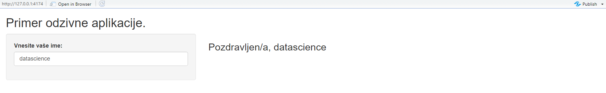

# Odzivni dashboard-i

## Priprava

V prvem predavanju  smo gradili statične aplikacije Shiny. V tem pa bomo pokazali, kako statičnim aplikacijam dodamo interaktivnost oziroma, z drugim izrazom, **odzivnost** na uporabnikove spremembe. Zato bomo danes bolje spoznali strežniško funkcijo `server`. Najprej pa spoznajmo, kaj so vhodi in izhodi aplikacij Shiny.

### Vhodi in izhodi {-}

Aplikacija je **odzivna** , ko ima objekte, ki sprejmejo uporabnikov ukaz ali vnos podatkov (**vhod**) in objekte, ki prikažejo rezultate tega ukaza ali vnosa (**izhod**). Vhode smo delno že obravnavali v prejšnjem predavanju, ko smo govorili o **widget-ih**. Za nekatere **widget-e**, kot so `textInput`, `dateInput`, `radioButtons` in `checkboxInput`, je očitno, da služijo vnosu.

Kot smo povedali na prvem predavanju, vsakemu vhodu podamo *identifikacijsko ime*, ki je lahko sestavljeno le iz črk, številk in podčrtajev. Pomembno je, da se držimo tega pravila, ker bo aplikacija vrednosti vhoda shranila v element seznama `input` s tem identifikacijskim imenom.

Na podoben način so definirani tudi izhodi. Obravnavali bomo te tipe izhodov:

- `textOtput`: izpiše besedilo, 
- `plotOutput`: prikaže graf,
- `tableOutput`: izpiše tabelo,
- `uiOutput`: prikaže widget,
- `imageOutput` prikaže sliko.

Spodnji odseku kode prikazuje primer, kako v aplikacijo dodamo izhode:

```{r eval = F}

ui <- fluidPage(

  titlePanel("Primer izhodov"),
  plotOutput("primer_plot"), #primer_plot je identifikacijsko ime
  textOutput("primer_tekst") #primer_tekst je identifikacijsko ime
)

server <- function(input, output){}

shinyApp(ui = ui, server = server)
```

<div style= "border : 2px solid gray" style = "padding: 3px">

</div>

Čeprav smo v vmesnik vnesli izhode, ob zagonu aplikacije ti niso vidni, saj so prazni. Izhodi se prikažejo le, ko jim priredimo vrednost ali objekt, za kar potrebujemo strežniško funkcijo.

## Strežniška funkcija

Sedaj, ko smo spoznali vhode in izhode, lahko nadaljujemo s spoznavanjem strežniške funkcije. Kot smo že omenili na prvem predavanju, bomo v strežniško funkcijo zapisali vse ukaze, ki so potrebni za pravilen izpis v naši aplikaciji. Ko bo aplikacija zaznala spremembo ali drugo dejanje s strani uporabnika, bo ukaze znotraj strežniške funkcije ponovno izvršila in posodobila prikaz.

### Odzivni tekst

Dodajmo prejšnjemu primeru strežniško funkcijo, ki izpiše besedilo:

```{r eval = F}

ui <- fluidPage(

  titlePanel("Primer izhodov"),
  plotOutput("primer_plot"), #primer_plot je identifikacijsko ime
  textOutput("primer_tekst") #primer_tekst je identifikacijsko ime
)

server <- function(input, output){
  output$primer_tekst <- "Izhodni tekst!"
}

shinyApp(ui = ui, server = server)

```

Opazimo, da še ne deluje, saj se nam v konzoli prikaže napaka:

`Error : Unexpected character object for output$primer_tekst`
  `i Did you forget to use a render function?`

Napaka nas sprašuje, če smo pozabili uporabiti funkcijo **render**, ki predstavlja odzivno funkcijo. Če želimo, da bo aplikacija odzivna, moramo kodo zapisati v **odzivnem kontekstu** znotraj funkcije `renderText()`. 

Naši strežniški funkciji dodamo funkcijo `renderText()`:

```{r eval = F}

server <- function(input, output){

output$primer_tekst <- renderText("Izhodni tekst!") # odzivni kontekst

}

```

<div style= "border : 2px solid gray" style = "padding: 3px">

</div>

Sedaj aplikacija deluje pravilno. Vhod, ki je v tem primeru konstanten, smo podali v odzivni kontekst, funkcija `renderText()` pa je rezultat tega konteksta predala na izhod. Čeprav je vrednost izhoda `primer_plot` prazen, imamo na dashboard-u  prostor za izris grafa.

Poskusimo sestaviti aplikacijo, ki vsebuje polje za vnos imena in polje, v katerem nam izpiše pozdrav glede na vnešeno ime.

```{r eval=F}

ui <- fluidPage(

titlePanel("Primer odzivne aplikacije."),

  sidebarLayout(
    sidebarPanel(
      textInput("ime", "Vnesite vaše ime: ") # vhod
      ),
    mainPanel(
      h3("Pozdravljen/a, ", 
        textOutput("izpis", inline = T) # izhod
      ),
    )
  )
)


server <- function(input, output) {
  output$izpis <- renderText(input$ime)
}

shinyApp(ui = ui, server = server)

```

<div style= "border : 2px solid gray" style = "padding: 3px">

</div>

Če poskusimo vnesti besedilo v aplikacijo, opazimo, da se izpis samodejno posodobi takoj po vnosu nove črke, če za vnosom za trenutek počakamo. Ni pa nujno, da le prepišemo vhod na izhod. Vhod lahko poljubno preoblikujemo kar znotraj odzivnega konteksta tako, da v zavitih oklepajih podamo ukaze, ki preoblikujejo vhod v izhod.

Oglejmo si posodobljeno strežniško funkcijo, ki polepša naš izpis.

```{r eval=F}

server <- function(input, output){

  output$izpis <- renderText({
    ime <- input$ime
    if(nchar(ime) < 2){ #pri praznem polju ali 1 črki izpiši navodila.
      ime <- "prosim vnesi svoje ime."
    }else{
      if(ime == "datascience"){
        ime <- "DataScience@UL-FRI"
      }else{
        ime <- paste(toupper(substr(ime, 1, 1)), #prva črka naj bo velika
                     substr(ime, 2, nchar(ime)), #ostale črke skopiramo
                     "!", #dodamo še klicaj
                     sep = "")
      }
    }
    ime
  })
}

```

<div style= "border : 2px solid gray" style = "padding: 3px">


</div>

Na zgornji sliki nam aplikacija olajša vnos  logotipa DataScience@UL-FRI in polepša izpis imen.


### Branje datotek in prikaz tabel

Sedaj si poglejmo, kako lahko z aplikacijo Shiny preberemo datoteko. Uporabili bomo podatkovno zbirko *osebe8.csv*, ki vsebuje izmišljene podatke o višini, teži, spolu in imenih oseb. Aplikacija vsebuje polje za vnos poti do datoteke, drsnik, ki določi maksimalno dolžino izpisane tabele, in polje za izpis tabele.

```{r eval = F}

ui <- fluidPage(sidebarLayout(
  sidebarPanel(
    # Polje za vnos datoteke
    fileInput(
      inputId = "dat",
      label = "Izberi datoteko:",
      buttonLabel = "Brskaj",
    ),
    
    # Drsnik
    sliderInput(
      inputId = "dol",
      label = "Maksimalna dolžina izpisa:",
      min = 1,
      max = 10,
      value = 3
    )
  ),
  
  mainPanel(tableOutput("tabela"))
))


server <- function(input, output) {
  # Izpis tabele
  output$tabela <- renderTable({
    if (!is.null(input$dat)) {
      head(read.csv(input$dat$datapath), input$dol)
    }
  })
}

shinyApp(ui = ui, server = server)

```

<div style= "border : 2px solid gray" style = "padding: 3px">


</div>

Naša aplikacija lahko prikaže katerekoli podatke v obliki .csv, ki jih prebermo s funkcijo `read.csv`. Izpiše pa lahko največ 10 vrstic. V zgornji aplikaciji opazimo, da funkcija `fileInput` prebere le metapodatke datoteke, dejanske podatke pa nato naložimo v strežniški funkciji. Metapodatki, ki so na voljo:

- name: ime datoteke
- size: velikost datoteke v bajtih
- type: MIME tip datoteke
- datapath: pot do začasnih podatkov


## Odzivni graf

Sedaj si oglejmo zahtevnejši primer aplikacije, ki vsebuje odzivni graf. Tokrat bo aplikacija samodejno brala podatke, zato morajo biti shranjeni znotraj mape aplikacije. Aplikacija naj prikaže graf teže v odvisnosti od višine in naj daje uporabniku možnost, da filtrira podatke po spolu in prikaže trendno črto.


```{r eval = F}
library(shiny)
library(ggplot2)

# Naložimo in pripravimo podatke
df <- read.csv("osebe8.csv", stringsAsFactors = T)
levels(df$Spol) <- c("Ženske", "Moški")

ui <- fluidPage(titlePanel("Primer odzivnega grafa:"),
                sidebarLayout(
                  sidebarPanel(
                    
                    # Filter za spol
                    selectInput(
                      "select_spol",
                      label = "Izberite spol:",
                      choices = c("Vsi",
                                  "Moški",
                                  "Ženske"),
                      selected = 'Vsi',
                    ),
                    
                    # Opcija za prikaz trendne črte
                    checkboxInput("trend_l",
                                  label = "Trendna črta",
                                  value = F)
                  ),
                  mainPanel(# Graf
                    plotOutput("graf"))
                ))

server <- function(input, output) {
  
  # koda za izris grafa
  output$graf <- renderPlot({
    #Apliciramo filter
    if (input$select_spol != 'Vsi') {
      df <- df[df$Spol == input$select_spol,]
    }
    
    # Izrišemo graf
    pl <- ggplot(df, aes(x = Visina, y = Teza, color = Spol)) +
      geom_point()
    
    # Grafu dodamo trendno črto, če je tako označeno
    if (input$trend_l) {
      pl <- pl + geom_smooth(
        aes(x = Visina, y = Teza),
        method = 'lm',
        formula = y ~ x,
        inherit.aes = F
      )
    }
    
    # Vrnemo končni graf
    pl
  })
}


shinyApp(ui = ui, server = server)

```

<div style= "border : 2px solid gray" style = "padding: 3px">


</div>

V zgorjni kodi vidimo, da potrebujemo dva vhoda, *select_spol* in *trend_l*. Z vhodom *select_spol* iz tabele izberemo le vrstice, ki nas zanimajo, z uporabo *trend_l*, pa s pomočjo linearnega modela na grafu narišemo linearni trend teže v odvisnosti od višine višine.

### Odzivni widgeti

V prejšnjem primeru, kjer smo izpisovali tabelo, smo imeli drsnik, ki je določal maksimalno število izpisanih vrstic. Mejni vrednosti drsnika sta bili 1 in 10. Če želimo zgornjo mejo drsnika nastaviti na število vseh prebranih vrstic v tabeli s podatki, lahko ustvarimo odziven drsnik s pomočjo funkcije `outputUI()`. Tak drsnik se bo posodobil vsakič, ko bomo prebrali datoteko:

```{r eval = F}


ui <- fluidPage(sidebarLayout(sidebarPanel(
  # Polje za vnos datoteke
  fileInput(
    inputId = "datoteka",
    label = "Izberi datoteko:",
    buttonLabel = "Brskaj...",
  ),
  # Odzivni widget
  uiOutput("odzivni_drsnik")
),
mainPanel(tableOutput("tabela"))))

server <- function(input, output) {
  output$odzivni_drsnik <- renderUI({
    if (!is.null(input$datoteka)) {
      podatki <- read.csv(input$datoteka$datapath)
      sliderInput(
        inputId = "drsnik_dolzina",
        label = "Dolžina izpisa:",
        min = 1,
        max = nrow(podatki),
        value = min(5, nrow(podatki), na.rm = T),
        step = 1
      )
    }
  })
  
  output$tabela <- renderTable({
    if (!is.null(input$datoteka)) {
      head(read.csv(input$datoteka$datapath),
           input$drsnik_dolzina)
    }
  })
}

```

<div style= "border : 2px solid gray" style = "padding: 3px">


</div>

Podobno, kot smo to naredili za besedilo, tabele in graf, lahko spremenljivki v **output-u** priredimo drsnik. Ta mora biti definiran znotraj odzivnega konteksta v funkciji `renderUI()`. V tem primeru dodamo pogoj, da se drsnik prikaže samo, če izberemo datoteko.

Bodimo pozorni, da je `odzivni_drsnik` **izhod**,  `drsnik_dolzina` pa **vhodna** vrednost za njegov parameter `max`. Kot vidimo, imajo lahko tudi izhodi svoje vhode.

## Funkcija `reactive()`

Pogosto želimo podatke preoblikovati na način, ki se ne spreminja, nato pa prikazati na več različnih načinov. Recimo, da bi želeli podatkom oseb spremeniti vrednosti v stolpcu spol tako, da bi bil spol zapisan s celo besedo. To bi želeli spremeniti v tabeli in v grafu. Vrednosti vhodov lahko beremo in spreminjamo le v odzivnem kontekstu znotraj funkcij `renderPlot` in `renderTable`. V tem primeru bi morali v izraz za izpis vsakega izhoda posebej napisati iste ukaze, ki posodobijo stolpec spol. Temu se izognemo z uporabo funkcije `reactive()`, ki ustvari odzivni izraz, ki ga lahko ponovno uporabimo. Odzivni izraz si lahko predstavljamo kot pomožno funkcijo za obdelavo “vhoda-izhoda ”, ki v aplikaciji ni viden. Njegova vrednost se, tako kot pri ostali vhodih in izhodih, spremeni ob vsaki spremembi. Tu je primer, ki združuje prejšnje primere:

```{r eval = F}
ui <- fluidPage(sidebarLayout(
  sidebarPanel(
    fileInput(
      inputId = "datoteka",
      label = "Izberi datoteko:",
      buttonLabel = "Brskaj...",
    ),
    
    # Filter za spol
    selectInput(
      "select_spol",
      label = "Izberite spol:",
      choices = c("Vsi",
                  "Moški",
                  "Ženske"),
      selected = 'Vsi',
    ),
    
    # Opcija za prikaz trendne črte
    checkboxInput("trend_l",
                  label = "Trendna črta",
                  value = F),
    uiOutput("odzivni_drsnik")
  ),
  
  mainPanel(plotOutput("graf"),
            tableOutput("tabela"))
))

server <- function(input, output) {
  # odzivni izraz
  osebe <- reactive({
    if (!is.null(input$datoteka)) {
      df <- read.csv(input$datoteka$datapath, stringsAsFactors = T)
      levels(df$Spol) <- c("Ženske", "Moški")
      df
    }
  })
  
  output$odzivni_drsnik <- renderUI({
    if (!is.null(input$datoteka)) {
      sliderInput(
        inputId = "drsnik_dolzina",
        label = "Dolžina izpisa:",
        min = 1,
        max = nrow(osebe()),
        value = 5,
        step = 1
      )
    }
  })
  
  output$tabela <- renderTable({
    if (!is.null(input$drsnik_dolzina)) {
      head(osebe(), input$drsnik_dolzina) # kličemo reaktivni izraz
    }
  })
  
  # koda za izris grafa
  output$graf <- renderPlot({
    if (!is.null(input$datoteka)) {
      
      #Apliciramo filter
      df <- osebe()
      if (input$select_spol != 'Vsi') {
        df <- df[df$Spol == input$select_spol,]
      }
      
      # Izrišemo graf
      pl <- ggplot(df, aes(x = Visina, y = Teza, color = Spol)) +
        geom_point()
      
      # Grafu dodamo trendno črto, če je tako označeno
      if (input$trend_l) {
        pl <- pl + geom_smooth(
          aes(x = Visina, y = Teza),
          method = 'lm',
          formula = y ~ x,
          inherit.aes = F
        )
      }
      # Vrnemo končni graf
      return(pl)
    }
  })
}

shinyApp(ui = ui, server = server)

```

<div style= "border : 2px solid gray" style = "padding: 3px">


</div>

Ko uporabljamo odzivne izraze, moramo paziti, da jih kličemo z oklepaji. Tabelo oseb obdelamo le enkrat znotraj odzivnega izraza. Tako lahko pohitrimo posodobitve naših dashboard-ov , predvsem ko imamo več izhodov, ki zahtevajo podobno obdelavo obsežnih podatkov. V našem primeru opazimo tudi, da za izris grafa vrnjene podatke iz funkcije `reactive()` preprosto filtriramo.

## Domača naloga

Uporabite uporabniški vmesnik, ki ste ga sestavili pri prejšnji domači nalogi. V desnem stolpcu, ki smo ga namenoma pustili praznega, prikažite z razpredelnico zadnjih pet prijavljenih strank. Pod tabelo dodajte graf, ki prikazuje število novih strank skozi čas.

<div style= "border : 2px solid gray" style = "padding: 3px">


</div>

***
