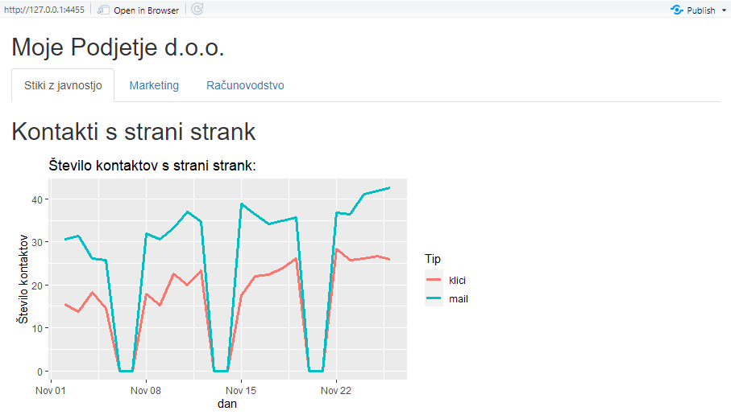
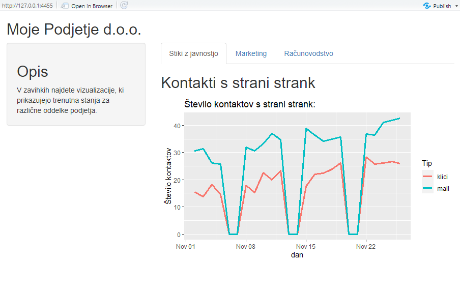
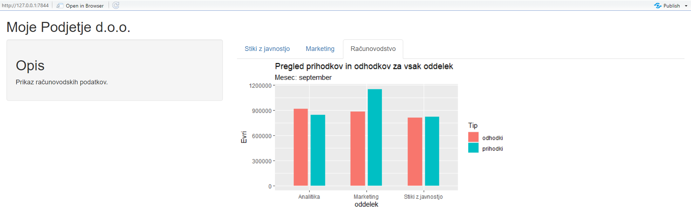
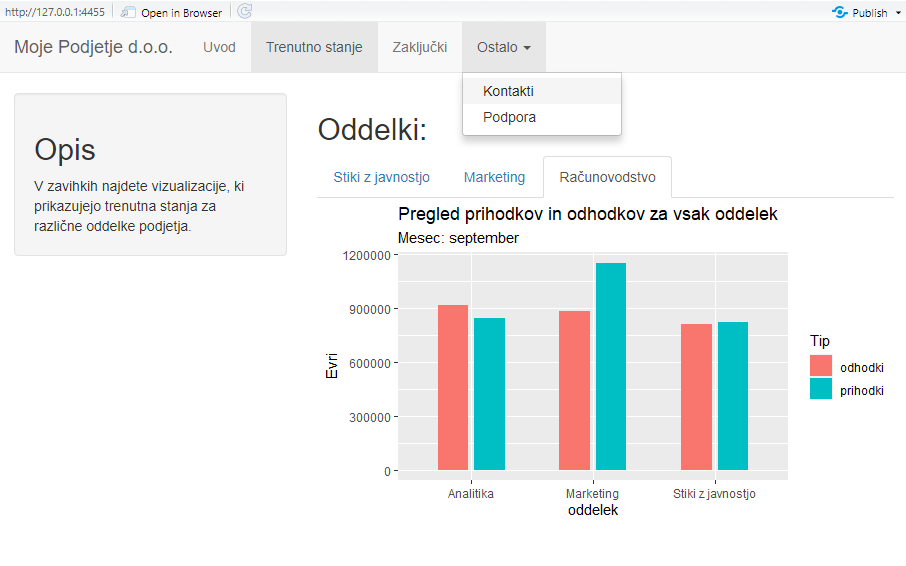
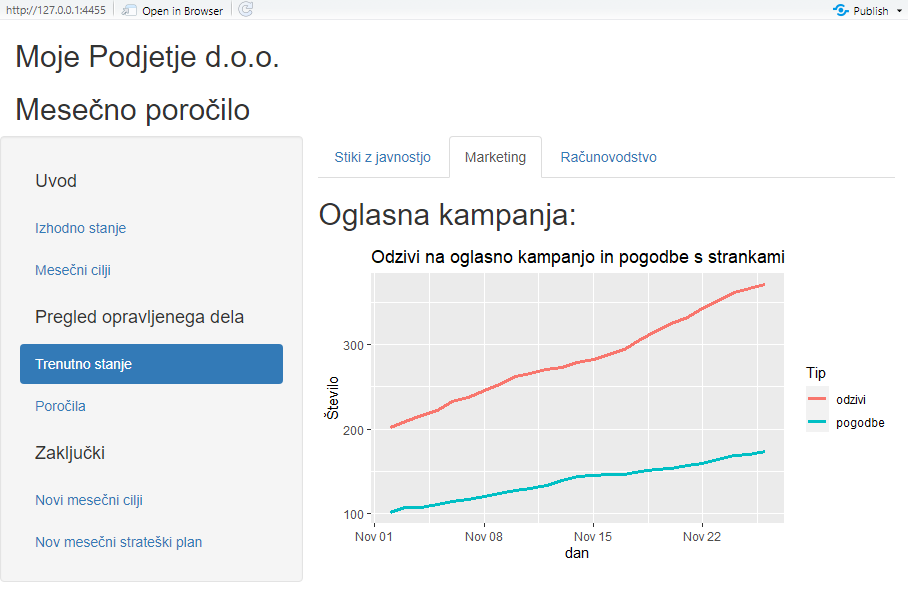
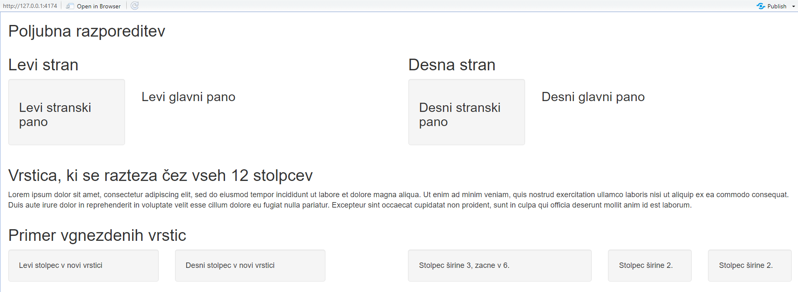
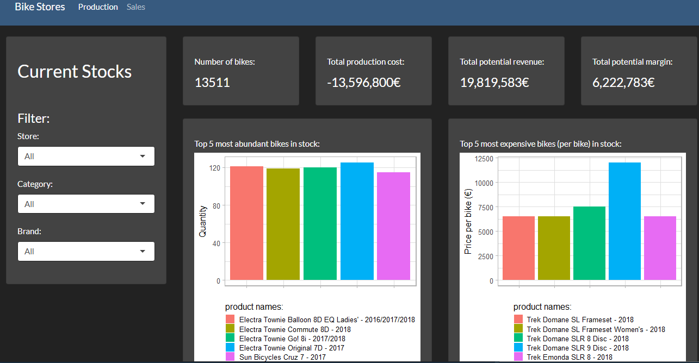
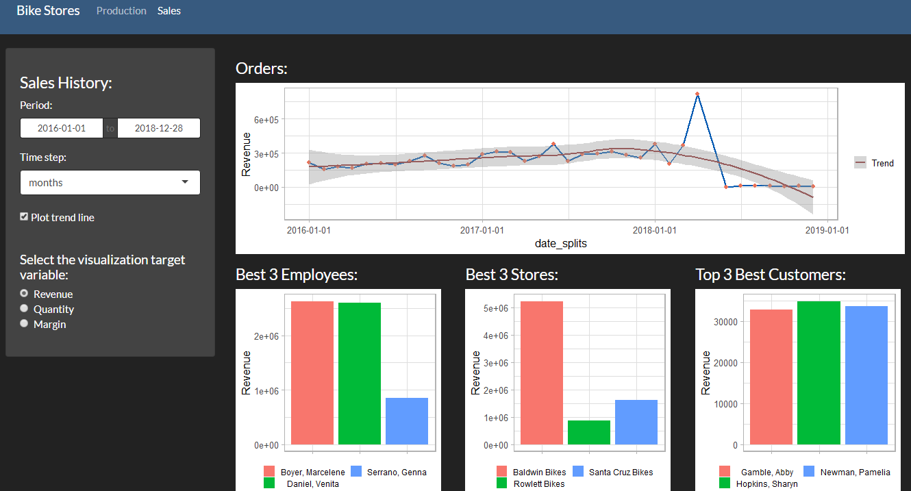

# Urejanje oblike in razporeditve dashboard-a

Na prvem predavanju smo spoznali, da obliko aplikacije urejamo v delu kode, ki skrbi za uporabniški vmesnik (`ui`). Razporeditev gradnikov v naši aplikaciji določamo na treh nivojih, in sicer:

- strani (*page*),
- razporeditve (*layout*),
- panoja (*panel*).

## Tip spletnih strani

Aplikacije so lahko razdeljene na eno ali več strani. V kodi za uporabniški vmesnik iz prejšnjih predavanj opazimo, da `ui` predstavlja funkcije `fluidPage`. Funkcija `fluidPage` pripravi vso potrebno kodo HTML, CSS in JavaScript, ki nam prikaže spletno stran v želeni obliki. Poleg funkcije `fluidPage` lahko uporabimo še funkciji `fixedPage` in `fillPage`, ko izdelujemo spletno stran z eno stranjo, ter funkcijo `navbarPage` za izdelavo aplikacij z več stranmi.

Funkcija `fluidPage` razporedi objekte enakomerno po celotni širini strani. Funkcija `fixedPage` deluje podobno kot `fluidPage`, s to razliko, da vsebuje omejitev širine končne spletne strani, kar skrbi za to, da se naša aplikacija ne razteza prekomerno čez celoten ekran. Če uporabimo `fillPage`, se aplikacija razširi čez celoten ekran oziroma brskalnik. Taka oblika spletne strani je primerna, ko želimo prikazati grafe na celotni spleti strani. 

Poženite spodnjo kodo in poizkusite spreminjati tip strani med `fluidPage`, `fixedPage` in `fillPage`, ter spremenite `height` v `width`. Spreminjajte tudi velikost okna. Kmalu boste opazili razliko vsaj med `fillPage` in ostalima dvema tipoma strani.

```{r, eval = F}

ui <- fillPage( #fluid, fixed
  img(src = "images/DS_FRI_logo.png", height = "95%") #width
)

server <- function(input, output){}

shinyApp(ui = ui, server = server)

```

Funkcija `navbarPage` daje uporabniku možnost, da preko zavihkov dostopa do različnih strani naše aplikacije. V nadaljevanju bomo večino časa uporabljali `fluidPage`, ker je najbolj prijazna za uporabo. Ko bomo spoznali razporeditve in panoje, bomo prikazali tudi primer uporabe `navbarPage`.

Spletna stran Shiny s `fluidPage` je sestavljena iz 12 enako-širokih navideznih stolpcev in poljubno mnogo vrstic. Vsak nov objekt, ki ga dodamo aplikaciji, se avtomatsko vstavi v novo vrstico. Višina vrstice je odvisna od velikosti objekta. V primeru, da bi z vrsticami prekoračili maksimalno višino našega ekrana, se lahko do zadnje vrstice pomaknemo s pomočjo miškinega kolesca. Čeprav ima lahko aplikacije poljubno višino, je pametno, da višino omejimo na višino okna.

## Razporeditve in panoji

Ko določimo tip strani, lahko najprej izberemo razporeditev objektov ali pa se osredotočimo na vstavljanje panojev. Razporeditve objektov določamo, ko želimo aplikaciji podati točno določeno strukturo (npr. imamo lahko več objektov v vsaki vrstici ali pa lahko ločimo stran na več delov). Panoje si lahko predstavljamo kot zabojnike, ki lahko vsebujejo različne objekte, kot so besedilo, grafi, vnosna polja, tabele, druge panoje...

En primer razporeditve - `sidebarLayout` - smo že spoznali na prvem predavanju. Sedaj si bomo ogledali ostale glavne vrste razporeditev in panojev. Nato bomo pokazali, kako ustvarimo razporeditev po želji.

### Razporeditve

Razporeditve, ki jih so na voljo:

- sidebarLayout: ustvari stranski in glavni pano,
- splitLayout: ustvari navpične stolpce,
- verticalLayout: vsak pano postavi v svojo vrstico,
- flowLayout: panoje razporedi od leve proti desni in od zgoraj navzdol.

Razporeditev `sidebarLayout` smo že spoznali. Sedaj poglejmo še razporeditev `splitLayout`.

```{r, eval = F}

ui <- fluidPage(
  splitLayout( # <- Spremenite še v verticalLayout in flowLayout
    img(src = "images/DS_FRI_logo.png"),
    img(src = "images/DS_FRI_logo.png"),
    img(src = "images/DS_FRI_logo.png")
    )
)

server <- function(input, output){}

shinyApp(ui = ui, server = server)
```

<div style= "border : 2px solid gray" style = "padding: 3px">


</div>

V tem primeru lahko na vsak logotip gledamo kot na pano zase. Ker uporabljamo `splitLayout`, je vsaka slika v svojem stolpcu. Ko širino okna zožimo, ostanejo trije stolpci. Razporeditev `verticalLayout`, logotipe ohrani enega pod drugim, neodvisno od raztezanja okna. V primeru uporabe razporeditve `flowLayout` pa bodo logotipi razporejeni v eno vrstico. Če okno zožamo, se bodo robni logotipi začeli premikati v spodnjo vrstico.

### Večje število hkratnih prikazov

Recimo, da želimo za svoje podjetje izdelati aplikacijo za spremljanje poslovanja različnih oddelkov (npr. oddelek za stike z javnostmi, trženje ali računovodstvo). Z eno izmed izbranih razporeditev lahko vse informacije prikažemo hkrati. Na spodnji sliki je primer take aplikacije, ki uporablja razporeditev `verticalLayout`. Če želimo videti podatke za računovodstvo, se moramo pomikati navzdol.

```{r, eval = F}
ui <- fluidPage(h2("Moje Podjetje d.o.o."),
                verticalLayout(
                  img(src = "images/PR.png"),
                  img(src = "images/marketing.png"),
                  img(src = "images/racunovodstvo.png")
                ))

```

<div style= "border : 2px solid gray" style = "padding: 3px">


</div>

Z uporabo razporeditve `splitLayout` tvegamo, da bi bil prikaz v primeru ozkega ekrana nepregleden. Težava je, da imamo preveč informacij, da bi jih lahko smiselno prikazali na eni strani. Hkrati pa so te informacije že logično ločene po kategorijah (PR, trženje in računovodstvo). Bolj smiselno bi bilo, da bi uporabnik izbral le želene informacije. V nadaljevanju si bomo ogledali nekaj načinov, kako to doseči.

_Pozor_: V zgornjem primeru nismo uporabili pravih interaktivnih izhodov, ampak smo uporabili slike namesto grafov, da se koda aplikacije poenostavi in se lahko osredotočimo na razporejanje elementov.

### Pano z zavihki

Pano `tabsetPanel` opravlja funkcijo razporeditve in panoja istočasno. Vsebino nam razporedi v podstrani, ločene z zavihki. Uporabljamo ga, ko vsaka podstran naše aplikacije zajema nek neodvisen proces, kjer ni potrebe, da so vse informacije prikazane hkrati. Ravno to smo želeli prikazati v prejšnjem primeru. 

Poglejmo si primer:

```{r eval = F}
ui <- fillPage(
  titlePanel("Moje Podjetje d.o.o."),
  
  tabsetPanel(
    id = "tabset",
    
    tabPanel(
      value = "tab1",
      "Stiki z javnostjo",
      h2("Kontakti s strani strank"),
      img(src = "images/PR.png",
          align = "center")
    ),
    
    tabPanel(
      value = "tab2",
      "Marketing",
      h2("Oglasna kampanja:"),
      img(src = "images/marketing.png",
          align = "center")
    ),
    
    tabPanel(
      value = "tab3",
      "Računovodstvo",
      img(src = "images/racunovodstvo.png",
          align = "center")
    ),
  )
)

```

<div style= "border : 2px solid gray" style = "padding: 3px">



</div>

Pano `tabsetPanel` lahko kombiniramo z ostalimi razporeditvami in paneli. Primer je kombinacija z razporeditvijo `sidebarLayout`, ki nam omogoča, da levi stranski stolpec namenimo predstavitvi podjetja ali navodilom za uporabo aplikacije, medtem ko so v desnem stolpcu prikazani grafi.

```{r eval = F}


ui <- fluidPage(titlePanel("Moje Podjetje d.o.o."),
                sidebarLayout(
                  sidebarPanel(
                    h2("Opis"),
                    "V zavihkih najdete vizualizacije, ki prikazujejo trenutna \
    stanja za različne oddelke podjetja."
                  ),
    
    mainPanel(tabsetPanel(
      id = "tabset",
      tabPanel(
        value = "tab1",
        "Stiki z javnostjo",
        h2("Kontakti s strani strank"),
        img(src = "images/PR.png",
            align = "center")
      ),
      
      tabPanel(
        value = "tab2",
        "Marketing",
        h2("Oglasna kampanja:"),
        img(src = "images/marketing.png",
            align = "center")
      ),
      
      tabPanel(
        value = "tab3",
        "Računovodstvo",
        img(src = "images/racunovodstvo.png",
            align = "center")
      ),
    ))
                ))

```

<div style= "border : 2px solid gray" style = "padding: 3px">



</div>

Zgornji primer lahko posodobimo tako, da se opis v stranskem panoju odziva glede na aktivni zavihek. To storimo tako, da dodamo še izhod tekst in posodobimo strežnisko funkcijo, kakor je prikazano tu:


```{r, eval = F}

ui <- fluidPage(titlePanel("Moje Podjetje d.o.o."),
                
                sidebarLayout(
                  sidebarPanel(h2("Opis"),
                               p(textOutput("opis_zavihka")), ),
                  
                  mainPanel(tabsetPanel(
                    id = "tabset",
                    
                    tabPanel(
                      value = "tab1",
                      "Stiki z javnostjo",
                      h2("Kontakti s strani strank"),
                      img(src = "images/PR.png",
                          align = "center")
                    ),
                    
                    tabPanel(
                      value = "tab2",
                      "Marketing",
                      h2("Oglasna kampanja:"),
                      img(src = "images/marketing.png",
                          align = "center")
                    ),
                    
                    tabPanel(
                      value = "tab3",
                      "Računovodstvo",
                      img(src = "images/racunovodstvo.png",
                          align = "center")
                    ),
                  ))))

server <- function(input, output) {
  output$opis_zavihka <- renderText({
    print(names(input$tabset))
    if (input$tabset == "tab1") {
      return("Prikaz PR Kampanje.")
    }
    if (input$tabset == "tab2") {
      return("Prikaz oglasne Kampanje.")
    }
    if (input$tabset == "tab3") {
      return("Prikaz računovodskih podatkov.")
    }
  })
}

```

<div style= "border : 2px solid gray" style = "padding: 3px">



</div>

### Stran z navigacijo

Če je vsebina, ki jo želimo prikazati v naši aplikaciji, zelo obširna, postanejo zavihki nepregledni. V ta namen lahko uporabimo obliko strani `navbarPage`. Ta nam vsako podstran uredi pod novim zavihkom in omogoča dodajanje spustnega menija. Nov zavihek ustvarimo z funkcijo `tabPanel` (prvi parameter vsebuje ime zavihka). Nato definiramo izgled prikaza panoja pod tem zavihkom. S funkcijo `navbarMenu`lahko dodamo spustni meni.

Poglejmo si nekoliko obsežnejši primer:

```{r eval = F}
ui <- navbarPage(
  "Moje Podjetje d.o.o.",
  #To je naslov menija/strani
  #To se bo prikazalo pod prvim zavihkom "Uvod"
  tabPanel(
    "Uvod",
    h2("Uvod"),
    "To je aplikacija za mesečno poročilo podjetja 'Moje Podjetje'."
  ),
  
  #To se bo prikazalo pod drugim zavihkom "Trenutno stanje"
  tabPanel("Trenutno stanje",
           
           sidebarLayout(
             sidebarPanel(
               h2("Opis"),
               "V zavihkih najdete vizualizacije, ki prikazujejo trenutna \
stanja za različne oddelke podjetja."
             ),

mainPanel(
  titlePanel("Oddelki:"),
  tabsetPanel(
    id = "tabset",
    
    tabPanel(
      value = "tab1",
      "Stiki z javnostjo",
      h2("Kontakti s strani strank"),
      img(src = "images/PR.png",
          align = "center")
    ),
    
    tabPanel(
      value = "tab2",
      "Marketing",
      h2("Oglasna kampanja:"),
      img(src = "images/marketing.png",
          align = "center")
    ),
    
    tabPanel(
      value = "tab3",
      "Računovodstvo",
      img(src = "images/racunovodstvo.png",
          align = "center")
    ),
  )
)
           )),

#To se bo prikazalo pod tretjim zavihkom "Zaključki"
tabPanel("Zaključki",
         "Zaključki bodo na voljo po seji izvršnega odbora."),

#Četrti "zavihek" je spustni meni z dodatnimi izbirami
navbarMenu(
  "Ostalo",
  
  #Dodatna izbira "Kontakti"
  tabPanel(
    "Kontakti",
    img(src = "images/DS_FRI_logo.png"),
    br(),
    p("mail: datascience@fri.uni-lj.si")
  ),
  
  #Dodatna izbira "Podpora"
  tabPanel("Podpora", p("Under construction"))
)
)

```

<div style= "border : 2px solid gray" style = "padding: 3px">



</div>

Opazimo, da `navbarPage` ustvari zavihke čisto na vrhu strani. Na tak način preprosto prehajamo med različnimi deli naše aplikacije. Posamezne strani lahko še vedno ohranijo oblike in razporeditve, ki smo jih videli v prejšnjih primerih (primer zavihek "Trenutno stanje"). Poleg tega lahko zavihkom določimo več možnosti v obliki spustnega menija, kar vidimo na zavihku "Ostalo".

### Pano z navigacijo

Zadnja vrsta panoja, ki si jo bomo ogledali, je `navlistPanel`. Pri uporabi `navbarPage` lahko v primeru, ko imamo več zavihkov ali pa daljša imena zavihkov, zmanjka prostora v oknu. V takem primeru je bolj pregledno, če imena strani aplikacije prikažemo v obliki kazala. Ravno ta je glavna značilnost `navlistPanel` razporeditve. 

Ponovno si to poglejmo na primeru:

```{r eval = F}
ui <- fluidPage(
  titlePanel("Moje Podjetje d.o.o.", ),
  h2("Mesečno poročilo"),
  navlistPanel(
    id = "kazalo",
    "Uvod",
    tabPanel(value = "panel 1.1", "Izhodno stanje"),
    tabPanel(value = "panel 1.2", "Mesečni cilji"),
    "Pregled opravljenega dela",
    tabPanel(
      value = "panel 2.2",
      "Trenutno stanje",
      tabsetPanel(
        id = "tabset",
        tabPanel(
          value = "tab1",
          "Stiki z javnostjo",
          h2("Kontakti s strani strank"),
          img(src = "images/PR.png",
              align = "center")
        ),
        tabPanel(
          value = "tab2",
          "Marketing",
          h2("Oglasna kampanja:"),
          img(src = "images/marketing.png",
              align = "center")
        ),
        tabPanel(
          value = "tab3",
          "Računovodstvo",
          img(src = "images/racunovodstvo.png",
              align = "center")
        ),
      )
    ),
    tabPanel(value = "panel 2.3", "Poročila"),
    "Zaključki",
    tabPanel(value = "panel 1.2", "Novi mesečni cilji"),
    tabPanel(value = "panel 1.2", "Nov mesečni strateški plan"),
  )
)

```

<div style= "border : 2px solid gray" style = "padding: 3px">



</div>

Kot vidimo, se `tabPanel` z vrednostjo "panel 2.2" prikaže na desni polovici strani, njegova vsebina pa je v celoti definirana znotraj `tabPanel` funkcije. Na tak način bi lahko zelo obširno vsebino razdelili na več strani. 

### Ročno definirana razporeditev

Poleg že pripravljenih razporeditev, ki jih nudi Shiny, lahko sami določimo razporeditev. Strani aplikacij so razdeljene v vrstice, vsaka z dvanajstimi navideznimi stolpci, na katere lahko postavljamo poljubne objekte in panoje. Za poljubno razporeditev potrebujemo dve funkciji: `fluidRow` in `column`. Funkcija `fluidRow` ustvari novo vrstico, kot njene argumente pa podamo `column` funkcije. Prvi argument funkcije `column` predstavlja širino podano v številu stolpcev, čez katere se bodo raztezali objekti ali panoji. Poleg širine lahko s parametrom `offset` določimo tudi zamik stolpca. V tem primeru moramo paziti, da ne presežemo dvanajstega stolpca. Vrednost parametra `offset` se nanaša na zamik od prejšnjega definiranega stolpca (`column`), ne pa od levega roba spletne strani. Ko definiramo strukturo, lahko začnemo vstavljati objekte in panoje. Poglejmo si primer:

```{r eval = F}
library(shiny)

ui <- fluidPage(
  titlePanel("Poljubna razporeditev"),
  
  fluidRow(
    column(
      6,
      titlePanel("Levi stran"),
      sidebarLayout(sidebarPanel(h3("Levi stranski pano")),
                    mainPanel(h3("Levi glavni pano")))
    ),
    column(
      6,
      titlePanel("Desna stran"),
      sidebarLayout(sidebarPanel(h3(
        "Desni stranski pano"
      )),
      mainPanel(h3("Desni glavni pano")))
    )
  ),
  
  fluidRow(column(
    12,
    titlePanel("Vrstica, ki se razteza čez vseh 12 stolpcev"),
    p(
      "Lorem ipsum dolor sit amet, consectetur adipiscing elit, sed do eiusmod tempor incididunt ut labore et dolore magna aliqua. Ut enim ad minim veniam, quis nostrud exercitation ullamco laboris nisi ut aliquip ex ea commodo consequat. Duis aute irure dolor in reprehenderit in voluptate velit esse cillum dolore eu fugiat nulla pariatur. Excepteur sint occaecat cupidatat non proident, sunt in culpa qui officia deserunt mollit anim id est laborum."
    )
  )),
  
  fluidRow(
    column(
      5,
      titlePanel("Primer vgnezdenih vrstic"),
      fluidRow(column(6,
                      wellPanel(
                        "Levi stolpec v novi vrstici"
                      )),
               column(
                 6,
                 wellPanel("Desni stolpec v novi vrstici")
               )) # Vgnezdeni stolpci se morajo prav tako sešteti v 12
    ),
    column(3,
           offset = 1, # offset se upošteva od konca prejšnjega stolpca
           fluidRow(h2(br(
           )), # Prazna vrstica za lepši prikaz
           column(
             12,
             wellPanel("Stolpec širine 3, zacne v 6.")
           ))),
    column(3,
           fluidRow(
             h2(br()), # Prazna vrstica za lepši prikaz
             column(6, wellPanel("Stolpec širine 2.")),
             column(6, wellPanel("Stolpec širine 2."))
           ))
  )
)
```

<div style= "border : 2px solid gray" style = "padding: 3px">



</div>

Ob pregledu zgornjega primera opazimo, da lahko znotraj stolpca uporabimo razporeditve in panoje, kot pri navadni obliki strani. Edina razlika je, da je prikaz zožen. Poleg tega lahko znotraj stolpcev gnezdimo nove vrstice. Pri tem moramo paziti, da se širine stolpcev znotraj vgnezdenih vrstic seštejejo v 12. Dodan je tudi `wellPanel`, ki ustvari pano s temnejšim ozadnjem in obrobo, da bolje ločimo pozicije.

## Barvne sheme in teme

Za konec si poglejmo še, kako spreminjamo obliko oziroma barvo samih gradnikov. To naredimo z uporabo paketa `bslib`.

```{r message=FALSE}

#install.packages("bslib")

library(bslib)

```

Vse kar moramo storiti, da zamenjamo tematiko okna, je, da tipu okna podamo parameter `theme`:

```{r, eval = F}
ui <- fluidPage(

  theme = bs_theme(<parametri za obliko>),
...

```

Funkciji `bs_theme` lahko podamo naslednje parametre:

- version: verzija, ki jo uporabljamo (trenutno privzeta verzija 5),
- bootswatch: izbira prednastavljene teme,
- bg: barva ozadja,
- fg: barva ospredja - barva glavnega teksta,
- primary: barva za povezave,
- secondary: barva neizstopajočih component,
- success: barva sporočil o uspehih,
- info: barva pisave za informiranje,
- warning: barva za opozorila,
- danger: barva za napake,
- base_font: privzeta pisava,
- code_font: pisava za kodne izseke,
- heading_font: pisava za naslove,
- font_scale: faktor povečave pisave.

Aplikaciji iz prejžnjega primera spremenimo barvo ospredja v svetlo sivo ter ozadje v temno sivo. Barve lahko podajamo s privzetimi besedami ali v obliki RGB. Spremenimo še pisavo naslovov v pisavo *Courier*:

```{r, eval = F}
ui <- fluidPage(
  
  theme = bs_theme(fg = "lightgray",
                   bg = "#303030",
                   heading_font = c("Courier")),
  
  titlePanel("Poljubna razporeditev"),
  
...

```

<div style= "border : 2px solid gray" style = "padding: 3px">


</div>

Poglejmo si še uporabo prednstavljene barvne sheme *minty*:

```{r, eval= F}
ui <- fluidPage(

theme = bs_theme(bootswatch = "minty"),

titlePanel("Poljubna razporeditev"),
...

```

<div style= "border : 2px solid gray" style = "padding: 3px">


</div>

Vidimo, da je uporaba teh tem sila preprosta. Če želimo dobiti imena vseh prednastavljenih tem, uporabimo ukaz `bootswatch_themes()`

```{r}
bootswatch_themes()
```

## Domača naloga

Zamislite si, da vas prodajalec koles prosi, da mu sestavite dashboard, s katerim bo nadzoroval prodajo in zaloge v skladiščih. Prodajalec ima tri trgovine, vsaka trgovina pa ima svoje skladišče. Podatke o prodaji (_sales_) in o stanju v skladiščih (_production_) najdete v mapi "_data/DN3". Ti so agregacije originalnih tabel baze podatkov, ki jih najdete v podmapi "_bike\_stores_". Podatke smo pridobili na spletni strani https://www.sqlservertutorial.net/sql-server-sample-database/, na kateri si lahko ogledate njihovo shemo, ki vam bo pomagala razumeti povezave med njimi.

Dashboard naj bo sestavljen iz dveh strani: ena bo namenjena produkciji, druga pa prodaji. Stran produkcije naj prikaže podatek o količini, o stroških proizvodnje, o možnem prihodku in o morebitnem zaslužku koles na zalogi. Hkrati naj dashboard izriše grafa, na katerih prikaže 5 najdražjih in 5 najštevilčnejših koles na zalogi. Aplikacija mora nuditi možnost, da uporabnik podatke filtrira glede na trgovino, kategorijo in znamko koles.

Stran prodaje pa bo prikazovala graf prihodkov skozi čas. Hkrati naj prikazuje grafe za 3 najboljše zaposlene, trgovine in stranke. Slednje določimo tako, da izračunamo, kateri zaposleni, trgovina in stranka je ustvarila največji prihodek. Aplikacija mora uporabniku omogočiti, da izbere časovno obdobje prodaj. Poleg tega mora uporabnik imeti možnost, da namesto prihodkov kot metriko uporabi zaslužek ali pa količino koles.

Dashboard naj bo torej podoben temu:

<div style= "border : 2px solid gray" style = "padding: 3px">



</div>


<div style= "border : 2px solid gray" style = "padding: 3px">



</div>
