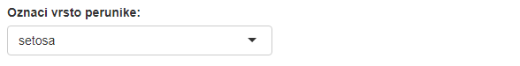
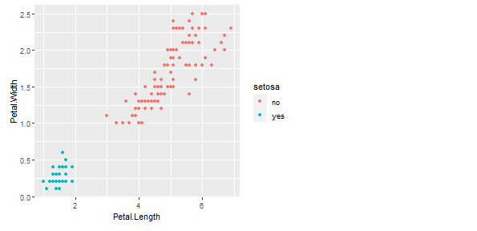
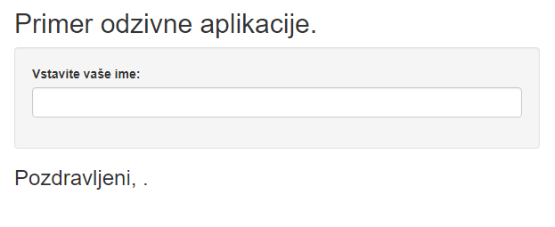
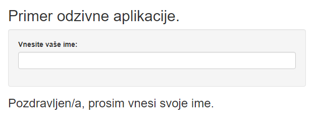

<style>
.DSout {
  border: 2px solid gray;
  padding: 3px
}
</style>


# Integracija Shiny v R Markdown

Do tukaj smo obravnavali samo Markdown oziroma R Markdown. Sedaj pa ga bomo združili še z Shiny R.

Integreramo lahko reaktivne widgete v R Markdown poročila. Kot prvo, ustvarimo nov R Markdown in izberimo *File -> New File -> R Markdown*, vendar pazimo, da sedaj izberemo opcijo "Shiny".

Glava dokumenta izgleda talkole:

```
---
title: "Shiny test"
output: html_document
runtime: shiny
---
```

Prva razlika, ki jo opazimo je v glavi dokumenta, kjer se je med nastavitvami našega dokumenta pojavil zapis `runtime: shiny`. Ta zapis omogoči, da naš dokument postane interaktiven in da podpira delovanje objektov paketa Shiny. V nadaljevanju bomo videli dva načina kako lahko takšne objekte uporabimo v R Markdown dokumentih, to je, z vstavljanjem posameznih widgetov ali pa z vstavljanem celotnih aplikacij.

## Integracija widgetov

Widgete v R Markdown dokument vstavimo znotraj kodnih odsekov, na podoben način kot v Shiny aplikacijah. Če v dokument vstavimo samo widgete, nam ni potrebno specificirati izhodov, saj je privzeto, da se bodo ti prikazali takoj pod kodnim odsekom. Funkcije, s katerimi v R Markdown ustvarimo razne widgete, so enake tistim za spletne aplikacije. Poglejmo si primer:

```{r include =F}
library(shiny)
```

```{r eval=FALSE}
library(ggplot2)
selectInput("species",
            "Označi vrsto perunike:", 
            choices = c("setosa", "versicolor", "virginica"))
```

<div style= "border : 2px solid gray" style = "padding: 3px">

</div>

```{r eval=FALSE}
df <- iris
df$setosa <- ifelse(iris$Species == "setosa", 'yes', 'no')
df$versicolor <- ifelse(iris$Species == "versicolor", 'yes', 'no')
df$virginica <- ifelse(iris$Species == "virginica", 'yes', 'no')

renderPlot({
  ggplot(df, aes_string(x = "Petal.Length", y = "Petal.Width", color = input$species)) +  geom_point()
})
```

<div style= "border : 2px solid gray" style = "padding: 3px">

</div>

Kot opazimo, v tem primeru `renderPlot` funkcije ni potrebno shranjevati v `output` seznam, saj R Markdown že ve, da mora te widgete izpisati na mestu, kjer se nahaja ta kodni odsek.

Ko vstavljamo widgete opazimo, da jih ne moremo razporejati po prikazu, kot smo to lahko delali pri spletnih aplikacijah. Uporaba samih widgetov je mišljena, da hitro in preprosto ponudi bralcu možnost spreminjanja prikaza. Bolj zapletene prikaze, kjer lahko tudi razporejamo razne widgete ustvarimo z integracijo celotnih aplikacij.

V primeru, da vaš R Markdown dokument v glavi ne vsebuje `runtime: shiny`, boste dobili spodnje opozorilo:

<div style= "border : 2px solid gray" style = "padding: 3px">

</div>

Če ciljni dokument ne podpira dinamičnih aplikacij se bo izrisala statična slika, v nasprotnem primeru pa morate za delovanje v blok kode dodati le še `library(shiny)`. S pritiskom na *Yes Always* se vam bo v glavo dokumenta dodal `runtime: shiny` in v glavi skripte se bo namesto gumba *knit* pojavil *run document*.

## Integracija celotnih aplikacij

V R Markdown poročila lahko integriramo že sestavljene Shiny aplikacije. To lahko storimo na dva načina: 

- iz vrstice, z ukazom `shinyApp`
- iz datoteke, z ukazom `shinyAppFile` ali `shinyAppDir`

Prvi način je popolnoma enak kot pri spletnih aplikacijah, kjer najprej definiramo uporabniški vmesnik, strežniško funkcijo in nato pokličemo `shinyApp` funkcijo. Poglejmo si primer:
```{r eval = F}
ui <- fluidPage(
    
    titlePanel("Primer odzivne aplikacije."),
    
    sidebarLayout(
        
        sidebarPanel(
            textInput("ime", "Vstavite vaše ime: ") # vhod
        ),
        
        mainPanel(
            h3("Pozdravljeni, ", 
               textOutput("izpis", inline = T),     # izhod
               "."
               ),
        )
    )
)

server <- function(input, output) {
  
    output$izpis <- renderText(input$ime)

}

shinyApp(ui = ui, server = server, options = list(height = 500))
```

<div style= "border : 2px solid gray" style = "padding: 3px">

</div>

Drugi način pa je bolj pregleden od prvega, vsaj iz vidika kode. Drugi način uporabimo, ko imamo že pripravljeno Shiny aplikacijo in bi jo želeli vnesti v dokument. To storimo takole:

```{r eval = FALSE}
shinyAppFile(
  "data/Predavanje_4/SayHello.R",
  options = list(width = "100%", height = 700)
)
```

<div style= "border : 2px solid gray" style = "padding: 3px">

</div>

Lahko pa seveda, podamo samo mapo v kateri se nahaja naša aplikacija s `shinyAppDir`.
