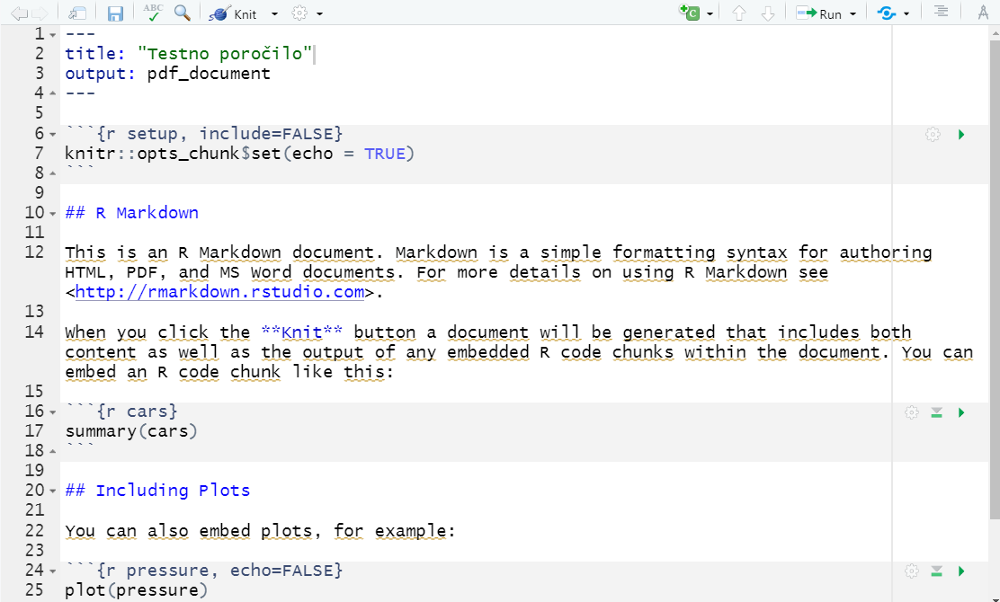

<style>
.DSout {
  border: 2px solid gray;
  padding: 3px
}
</style>

# Dinamična poročila v R Markdown
Priprava poročil je velikokrat zamuden proces. Poleg tega z orodji kot so Word, Excel in PowerPoint težko na jasen in učinkovit način vstavljamo, naš potek dela in dele kode, ki smo jih uporabili med analizo. Ravno s tem namenom se je razvil R Markdown, ki nam omogoča pripravo dinamičnih poročil z vključitvijo kode in njihovih rezultatov, kot so grafi, tabele ter tudi drugi objekti, s katerimi se pogosto srečujemo med analizo.

V tem predavanju bomo spoznali glavne zmogljivosti R Markdown dokumentov in kako lahko na preprost način sestavimo napredna poročila naših analiz. R Markdown je mešanica programskega jezika R in označevalnega jezika Markdown. Označevalji jezik (*angl. markup language*) je skupek ukazov, ki določajo, v kakšni obliki in formatu naj se besedilo prikaže v dokumentu. Na razliko od drugih označevalnih jezikov (HTML, LaTex, XML, ...), je Markdown zelo jasen in berljiv. Vedno več se ga uporablja za pisanje blogov, forumov, dokumentacij in poročil.

## Namestitev paketov
V pripravi si bomo namestili R Markodwn v RStudio in na kratko pregledali osnovne ukaze R Markdown-a. Za namestitev R Markdown-a v RStudio vtipkamo v konzolo naslednji ukaz:

```{r eval = FALSE}
install.packages("rmarkdown")
```

V primeru, da bi želeli poročila prikazati tudi v format PDF, moramo namestiti tudi eno izmed LaTeX distribucij. Najenostavneje je, da si naložite "TinyTex" direktno iz konzole:

```{r eval = FALSE}
tinytex::install_tinytex()
```
Ustvariti naš prvi R Markdown dokument: kliknemo na *File -> New File -> R Markdown*". V oknu, ki se nam pojavi, vtipkamo v ime dokumenta "Testno poročilo" in izberemo "PDF" za output format. Na levi strani pustimo tip dokumenta "Document". Ko stisnemo gumb "OK" se nam odpre nova skripta na spodnji sliki z osnovnimi navodili in primeri uporabe.

<div style= "border : 2px solid gray" style = "padding: 3px">

</div>

R Markdown besedila so shranjena s končnico *Rmd*. Opazimo lahko, da bo vsak R Markdown dokument imel tudi svojo unikatno orodno vrstico na vrhu skripte, podobno, kot Shiny R aplikacije. 

Na vrhu dokumenta imamo najprej odsek besedila, ki ga na začetku in koncu omejujejo tri zaporedni pomišljaji. To je glava dokumenta, ki vsebuje glavne nastavitve, kot so naslov, ime avtorja, datum in format, v katerega bomo prevedli končni dokument (*nastavitve so v YAML formatu, zato moramo biti previdni z zavihki*). Na spodnji sliki smo dodali še ime avtorja in datum.

<div style= "border : 2px solid gray" style = "padding: 3px">

</div>

Pomen ostalih ukazov, ki so vidni od tukaj dalje bomo obravnavali posebej. Za začetek poskušajte dokument *Splesti* s pritiskom na gumb *Knit* v orodni vrstici. V konzoli bi morali opaziti, da se dokument prevaja v izbran format, v našem primeru pdf. Če vse deluje pravilno se vam bo po nekaj sekundah odprl spodnji dokument. Dokument se nahaja v mapi, kjer ste imeli shranjeno prvotno Rmd skripto.

<div style= "border : 2px solid gray" style = "padding: 3px">

</div>

## Osnovni Markdown ukazi

Za začetek si bomo na kratko pogledali glavne ukaze v označevalnem jeziku Markdown. Najprej iz dokumenta izbrišemo ves tekst in pustimo le glavne nastavitve:

```
---
title: "testno_porocilo"
author: "DataScience@UL-FRI"
date: "08/10/2021"
output: pdf_document
---
```
***


Od tukaj dalje bo v sivem okvirju tekst, ki je namenjen temu, da ga napišete v vaš *Rmd* dokument. Z rdečo obrobo pa je označen odsek, ki je rezultat teh Markdown ukazov.

Dodajmo najprej naslov in nekaj besedila:

```{}
# Prvo poglavje
Napisali smo naše prvo poglavje v Markdown-u.
```

<div class =DSout>
# Prvo poglavje {-}
Napisali smo naše prvo poglavje v Markdown-u.
</div>

Kot vidimo naslov označimo na začetku vrstice z lojtro, ki ji sledi presledek ('#&nbsp;'), preostali tekst pa se normalno izpiše.

Če želimo sedaj dodati podpoglavja to storimo tako, da dodamo več lojtr. Primer:

```
# Prvo poglavje
Napisali smo naše prvo poglavje v Markdown-u.  
Nov odstavek pa začnemo tako, da v predhodno vrstico dodamo dva presledka.
Če dodamo samo enega ali nič, se stavek le nadaljuje.  

Odvečne    presledke    Rmarkdown odstrani.

# Drugo poglavje 
## Prvo podpoglavje
## Drugo podpoglavje
### Podpogavlje podpoglavja
```

<div class=DSout>
# Prvo poglavje{-}
Napisali smo naše prvo poglavje v Markdown-u.  
Novo vrstico pa začnemo tako, da v predhodno vrstico dodamo dva presledka. 
Če dodamo samo enega ali nič, se stavek le nadaljuje.

Odvečne    presledke    Rmarkdown odstrani.

# Drugo poglavje  {-}
## Prvo podpoglavje {-}
## Drugo podpoglavje {-}
### Podpogavlje podpoglavja{-}
</div>

Besede lahkko poudarimo z uporabo zvezd ali podčrtajev:
```
*pišemo* _ležeče_ ali pa **krepke** __črke__ ali pa ~~prečrtamo~~.

```
<div class=DSout>
*pišemo* _ležeče_ ali pa **krepke** __črke__ ali pa ~~prečrtamo~~.
</div>


Markdown preprosto oblikuje tudi sezname:

```
1. Prva beseda
2. Druga beseda
3. Tretja beseda
- Lepa beseda
- Grda beseda
- Prijazna beseda
```
<div class=DSout>

1. Prva beseda
2. Druga beseda
3. Tretja beseda
- Lepa beseda
- Grda beseda
- Prijazna beseda
</div>

Uporabljamo lahko tudi LaTex notacijo za vpeljavo formul:

```
Formula za ploščino kroga je: $A = \pi r^2$
```

<div class=DSout>
Formula za ploščino kroga je: $A = \pi r^2$
</div>

Krajše razpredelnice lahko vpišemu tudi ročno. Kasneje boste spoznali boljši način, kako podatke črpamo in prikažemo direktno iz baze.

``` 
Mesto     | Kratica | Prebivalstvo
:--------:| :-----: | :----------:
Ljubljana |    LJ   | 279,631
Koper     |    KP   | 25,753
Celje     |    CE   | 37,872
Maribor   |    MB   | 94,370
``` 
<div class=DSout>
Mesto     | Kratica | Prebivalstvo
:--------:| :-----: | :----------:
Ljubljana |    LJ   | 279,631
Koper     |    KP   | 25,753
Celje     |    CE   | 37,872
Maribor   |    MB   | 94,370

</div>

Dodamo lahko tudi opombe ali citate. Tukaj prikažemo samo opombo, če pa imate veliko citatov lahko uporabite tudi pakete namenjene prav citiranju kot sta __bibtex__ in __RefManageR__.
```
> "Only two things are infinite, the universe and human stupidity, and I'm not sure about the former."  
> - Albert Einstein

Primer opombe [^1].

[^1]: Opomba.
```
<div class=DSout>
> "Only two things are infinite, the universe and human stupidity, and I'm not sure about the former."  
> - Albert Einstein

Primer opombe [^1].

[^1]: Opomba.

</div>

Dodamo lahko tudi spletne povezave in slike.
```
Oglejte si spletno stran [DataScience](https://datascience.fri.uni-lj.si/).


```

<div class=DSout>
Oglejte si spletno stran [DataScience](https://datascience.fri.uni-lj.si/).


</div>

Za ostale posebne znake in pravila v Markdown-u si lahko pomagamo s ["cheat sheet-om"](https://www.markdownguide.org/cheat-sheet/).

## R Markdown
R Markdown je orodje, ki nam omogoča dinamično izvajanje R kode znotraj Markdown dokumentov. Glavna prednost tega pristopa je, da programsko kodo opravljene analize lahko na lep način opremimo z rezultati kode in našim opisom. Vsakič, ko spletemo R Markdown poročilo, se vsi kodni izseki izvedejo od začetka do konca, kar spodbuja in omogoča ponovljivost naših analiz. Poleg tega, končno poročilo lahko izvozimo v različne formate, od PDF poročil, Word dokumentov in html spletnih strani. V večini primerov bodo strani izgedale identično, razen majnih specifik, ki jih izhodni format mogoče ne podpira.

V pripravi na predavanje smo že povedali, da poročilo spletemo (ali prevedemo) v končni format s pritiskom na gumbom "Knit". Nismo pa omenili, da je ob vsakem prevajanju koda v svoji novi začasni R seji, kar omogoča popolno ponovljivost. To se pravi, da spremenljivke in funkcije, ki jih imamo definirane v trenutni R seji v RStudio-u (*tiste, ki smo definirali preko konzole*), ne bodo prišle v poštev med izvajanjem kode. Dobro je tudi , da se zavedamo, da nova R seja privzame za delovnego okolje lokacijo mape, v kateri se nahaja poročilo, tako da vemo kam shraniti potrebovane vhodne podatke in slike.

### Odseki kode

Temu sledi kos R kode, ki ga omejujejo tri zaporedni krativci (znak \`). Med vijugastima oklepajema pa so zapisani parametri, ki določajo programski jezik, ime kodnega odseka in obliko izpisa.

V pripravi smo se že srečali z odseki ali bloki kode (*angl. code chunks*), ki so bili vmeščeni med vrstice označene z tremi zaporednimi znaki \`. Prazen blok izgleda takole:

<div style= "border : 2px solid gray" style = "padding: 3px">

</div>

Nov kos kode lahko preprosto dodamo z bližnjico `Ctrl + Alt + I` ali pa s klikom na gumb "Insert" (zgoraj desno). Črka r znotraj zavitih oklepajev v prvi vrstici pomeni, da je to blok kode, ki izvaja R programski jezik. Markdown podpira tudi veliko drugih jezikov. V zavitih oklepajih lahko poleg jezika definiramo tudi ime odseka in parametre, ki določijo prikaz našega kosa kode in njegovega izračuna. Glavni paramtetri s katerimi se bomo večkrat srečali so:

- **echo**: FALSE pomeni, da se koda ne prikaže v končnem dokumentu (privzeto TRUE)
- **include**: FALSE pomeni, da se v končnem dokumentu ne prikaže koda niti ne rezultati. Kljub temu, da se koda ne prikaže se še vedno izvede. (privzeto TRUE)
- **eval**: FALSE pomeni, da se koda ne izvede, in če je `echo = T` se pokaže. Uporabno za prikaz kode z napakami. (privzeto TRUE)
- **collapse**: Prikaz kode in njegovega izhoda združimo v en izpis. (privzeto FALSE)
- **fig.width**, **fig.height**, **fig.allign**, **fig.cap**: širina, višina, poravnava in opis slike.

Poglejmo si primer istega kosa kode, ki izpiše tekst, kjer prej nastavimo parameter `collapse = T`, nato pa `collapse = F`:

<div style= "border : 2px solid gray" style = "padding: 3px">

</div>

<div class=DSout>
```{r collapse=T}
print("Primer bloka kode!")
```
</div>

In z `collapse = F`:

<div class=DSout>
```{r collapse=F}
print("Primer bloka kode!")
```
</div>
Kot vidimo je v končnem dokumentu (temle) izpis v drugem primeru razdeljen na dva dela, v prvem pa je v enem delu. Posamezne bloke kode lahko tudi med pisanjem poganjamo in rezultat se nam po pojavik kar znotraj RStudia, kar nam veliko pohitri pisanje dokumenta. To naredimo z gumbi, ki so v zgornjem desnem kotu vsakega kosa. Trikotnik požene trenutni blok, trikotnik nazvdol in kvadrat požene vse bloke do treutnega v dokumentu. Z pritiskom na kolešček, pa lahko nastavimo prej omenjene nastavitve bloka (eval, echo, itd.) in tudi druge.

Primer izpisa znotraj RStudia:

<div style= "border : 2px solid gray" style = "padding: 3px">

</div>


### Spremenljivke

Med prevajanjem se odseki kode izvajajo in hranijo, kot pri navadnih R skriptah. To pomeni, da se vse spremenljivke, funkcije in vmesni rezultati v R seji hranijo in sproti posodabljajo in so na voljo za kasnejšo uporabo znotraj dokumenta. Če želimo spremenljivke uporabljati izven kodnega bloka uporabimo \` r \ <ime_spremenljivke \>\`. S tem pristopom lahko krajše izračune dodamo, kar v tekst. Poglejmo, kaj nam vrne koda na naslednji sliki.

<div style= "border : 2px solid gray" style = "padding: 3px">

</div>

<div class=DSout>

```{r}
# Definiramo novo spremenljivko:
a <- 24
```

Dvakratna vrednost spremeljivke a je `r (2 * a)`.

</div>


Če pa spremenljivke ne bi definirali, bi nam blok kode vrnil napako:
<div class=DSout>
```{r collapse=T, warning=TRUE, error=TRUE}
print(b)
```
</div>

Zgornji izpis lahko dobite, če želite izpisati spremenljivko `b` ali pa v blok, ki definira `a`, podate bloku zavnodilo `eval = F`.

### Grafi

V poročilih se skoraj vedno poslužujemo razčičnih vizualizacij, da na kratko in učinkovito povzamemo glavne informacije skrite v podatkih, ali pa da prikažemo rezultate naše analize. V R Markdown-u grafe lahko na preprost način prikažemo tako, da dodamo kodni odsek, ki vsebuje kodo za pripravo grafa. Poglejmo si primer grafa z uporabo knjižnice _ggplot2_.

```{r include=FALSE}
library(ggplot2)
```

```{r fig.cap="Primer dinamičnega grafa.", message=FALSE}
# Naložimo podatke
df <- read.csv("../data/Predavanje_4/osebe.csv", header = T,)
# Prikažemo graf
ggplot(df, aes( x = visina, y = teza, color = spol)) + geom_point(size = 2) + 
    geom_smooth(aes( x = visina, y = teza, fill = "Linear Trend"),  method = "lm", inherit.aes = F) + ggtitle("Višina v odvisnosti od teže.")
```

Pri tem izpisu je skrito, da je kodni blok vseboval `fig.cap="Primer dinamičnega grafa."`, ter pred tem je skrit blook z ukazom `library(ggplot2)`, ki pa ga z uporabo `include = FALSE` nismo prikazali. S tem se izignemo prikazu nalaganja paketov v dokumentov, vseeno pa so paketi naloženi.

Če želimo prikakzati dva grafa stran ob strani dodamo parametra `out.width = '50%'` in `fig.show = 'hold'`, kot je prikazano spodaj.

```{r fig.width=5, fig.height=5, out.width='50%', fig.show='hold'}
ggplot(data = df, aes(x = spol, y =  visina, fill = spol)) + geom_bar(stat = "summary", fun = mean) + ggtitle("Povprečna višina za vsak spol.")
ggplot(data = df, aes(x = spol, y =  teza, fill = spol)) + geom_bar(stat = "summary", fun = mean) + ggtitle("Povprečna teža za vsak spol.")
```

Če pa imamo shranje grafe ali druge slike (v obliki *png*, *jpeg* ali *pdf*) in za njih njimamo izvorne kode, ker smo jih naprimer dobili od drugih, jih v dokument vključimo z funkcijo `include_graphics()` paketa `knitr`:

```{r}

```

V zgornjem primeru "::" pomeni, da želimo funkcijo `include_graphics()` iz paketa `kntir`, pri tem pa nam paketa niti ni potrebno predhodno naložiti.

### Razpredelnice

Razpredelnice v R Markdown-u lahko na pregleden način ustavarimo s funkcijo `kable`, ravno tako iz paketa `knitr`.

```{r, message=F, warning=F, out.width='60%'}
knitr::kable(head(df), )
```

V `df` so shranjeni podatki oseb iz enega izmed predhodnih kodnihi blokov.

